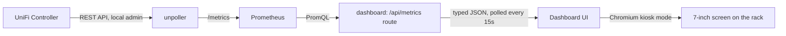

# mojorack

A cyberpunk-styled network operations dashboard for a rack-mounted Raspberry
Pi 4 driving a 7" screen — real UniFi telemetry (clients, APs, switches, WAN
throughput, per-device health) rendered as a neon HUD, no fabricated data.

## Features

- **Real telemetry, not a mockup.** Every number on screen comes from your
  actual UniFi controller via Prometheus — wired/wireless client counts,
  guests, WAN up/down throughput and latency, internet uptime, and per-device
  CPU/memory/temperature/uptime for every AP, switch, and gateway.
- **Cyberpunk 2077-inspired HUD.** Neon cyan/magenta on near-black, animated
  scanline overlay, glitch-flicker title, corner-bracketed panels, a live
  WAN throughput graph.
- **Graceful degradation.** If the controller or Prometheus goes away, the
  dashboard says so (`CONTROLLER LINK LOST`) instead of showing stale or fake
  numbers.
- **Self-contained stack.** One `docker compose up` runs the poller, metrics
  store, and dashboard together — no external services required.

## Architecture



- **unpoller** polls the UniFi controller and exposes the results as
  Prometheus metrics on `:9130`.
- **Prometheus** scrapes and stores them (15 day retention).
- **dashboard** (`dashboard/`) is a Next.js (App Router, TypeScript) app. A
  server route (`app/api/metrics/route.ts`) runs the PromQL, shapes it into a
  typed snapshot, and the client polls that route every 15s to render the
  HUD.

Everything runs as one `docker-compose` stack, meant to run directly on the
Pi4. Prometheus/unpoller can later move to a separate box without touching
the dashboard — it only ever talks to `PROMETHEUS_URL`.

## Requirements

- A UniFi controller (UDM/UDM Pro/Cloud Key/self-hosted) reachable on your
  network.
- Docker + Docker Compose, on whatever host runs the stack (a Pi4 works
  fine).
- A local admin account on the controller (see below) — not your ui.com
  cloud login.

## Hardware

- [Raspberry Pi 7" Touch Display 3U Rack Panel](https://makerworld.com/en/models/2556657-raspberry-pi-7-touch-display-3u-rack-panel?from=search#profileId-2816368) —
  3D-printable 3U rack panel that mounts the official Raspberry Pi 7" touch
  display (and a Pi 4 behind it) directly into a 10" rack.

## Quick start

### 1. Create a local admin account on your UniFi controller

Do **not** use your ui.com cloud login — cloud accounts require MFA and will
silently stall automated polling. In the UniFi OS controller UI:
**Settings → Admins → Add Admin**, create a new admin, and restrict it to
**local access only**. Give it a name like `mojorack-poller`.

### 2. Configure credentials

```sh
cp .env.example .env
# edit .env: UNIFI_CONTROLLER_URL, UNIFI_USER, UNIFI_PASS
```

`.env` is git-ignored — your credentials never get committed.

### 3. Run the stack

```sh
docker compose up -d --build
```

- Dashboard: http://\<host\>:3010 (mapped from the container's internal port
  3000 to avoid clashing with other local dev servers; change the host port
  in `docker-compose.yml` if 3010 is also taken)
- Prometheus (debug/raw queries): http://\<host\>:9090
- unpoller metrics endpoint: http://\<host\>:9130/metrics

### 4. Verify real data is flowing

Don't trust the dashboard until you've checked a concrete example:

```sh
docker compose ps                                    # unpoller should be "healthy"
curl http://<host>:9130/metrics | grep unpoller_site_users
curl -s http://<host>:3010/api/metrics | jq
```

If `controllerReachable` is `false` in `/api/metrics`, unpoller can't reach
or authenticate to the controller — check `docker compose logs unpoller`
first (auth errors show up clearly there, without ever logging the
password).

### 5. Kiosk mode on the 7" screen

On the Pi that drives the screen (can be the same Pi4 or a second one):

1. Copy `kiosk/kiosk.sh` to the Pi and adjust `DASHBOARD_URL` if the
   dashboard runs on a different host.
2. Install `kiosk/mojorack-kiosk.service` to `/etc/systemd/system/`, fixing
   the `User=` and `ExecStart=` path for your setup.
3. `sudo systemctl enable --now mojorack-kiosk`

## Project layout

```
docker-compose.yml         # unpoller + prometheus + dashboard
prometheus/prometheus.yml  # scrape config
dashboard/                 # Next.js app (App Router, TypeScript)
  app/api/metrics/route.ts   # server-side Prometheus queries -> typed JSON snapshot
  lib/                        # prometheus client, formatting helpers, shared types
  components/                 # HUD panels, stat tiles, sparklines, device grid
  Dockerfile                  # multi-stage build -> standalone Next.js output
kiosk/                      # Chromium kiosk launch script + systemd unit
```

## Troubleshooting

- **`unpoller` shows "unhealthy" in `docker compose ps`.** Its image health
  check pings InfluxDB by default even though this stack only uses
  Prometheus output. `UP_INFLUXDB_DISABLE: "true"` in `docker-compose.yml`
  turns that off — if you removed it, put it back.
- **Port already in use.** The dashboard publishes on host port `3010` (not
  `3000`) specifically to avoid clashing with other local dev servers.
  Change the left side of the `ports:` mapping in `docker-compose.yml` if
  `3010` is also taken.
- **`controllerReachable: false`.** Almost always an auth problem — check
  `docker compose logs unpoller` for a `403 Forbidden` or connection error,
  and confirm `.env` has a *local* admin account, not a ui.com login.

## Extending

Metric names used in `app/api/metrics/route.ts` are real `unpoller`
Prometheus exporter output — verified directly against `pkg/promunifi` in the
[unpoller source](https://github.com/unpoller/unpoller), not guessed. To add
a panel (per-client DPI usage, firewall drops, speedtest history, etc.):

1. Add the PromQL query in `route.ts`.
2. Extend the shape in `lib/types.ts`.
3. Add or update a component under `components/`.

## Credits

Built on [unpoller](https://github.com/unpoller/unpoller) and
[Prometheus](https://prometheus.io/).
